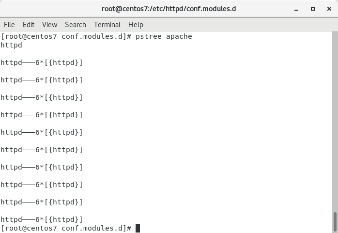

#### Task 1
[task1.sh](https://github.com/vickkoleda/apache_02/blob/master/task1.sh)
##### Screenshot of output of hybrid multi-process multi-threaded httpd server configuration

##### httpd is using worker module

##### Process tree after starting httpd daemon

##### Screenshots of output ab benchmarking tool

##### Process tree during ab testing

##### Screenshot of output of non-threaded httpd server configuration

##### httpd is using prefork module

##### Process tree after starting httpd daemon

##### Screenshots of output ab benchmarking tool

##### Process tree during ab testing

