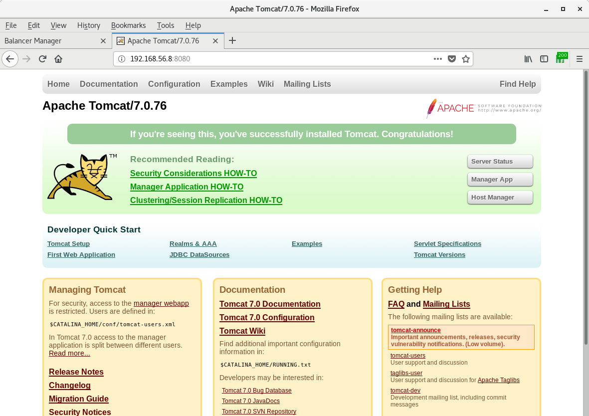

#### Task 2
[task2.sh](https://github.com/vickkoleda/apache_02/blob/master/task2.sh)
##### Screenshots of output of httpd configuration as forward proxy with authentication

##### Screenshots of forward proxy authentication window

##### Screenshots of output of httpd configuration as reverse proxy

##### Screenshots of reverse proxy redirect

##### Screenshots of balancer-manager authentication window

##### Screenshots of balancer-manager 

##### Screenshots of tomcat

